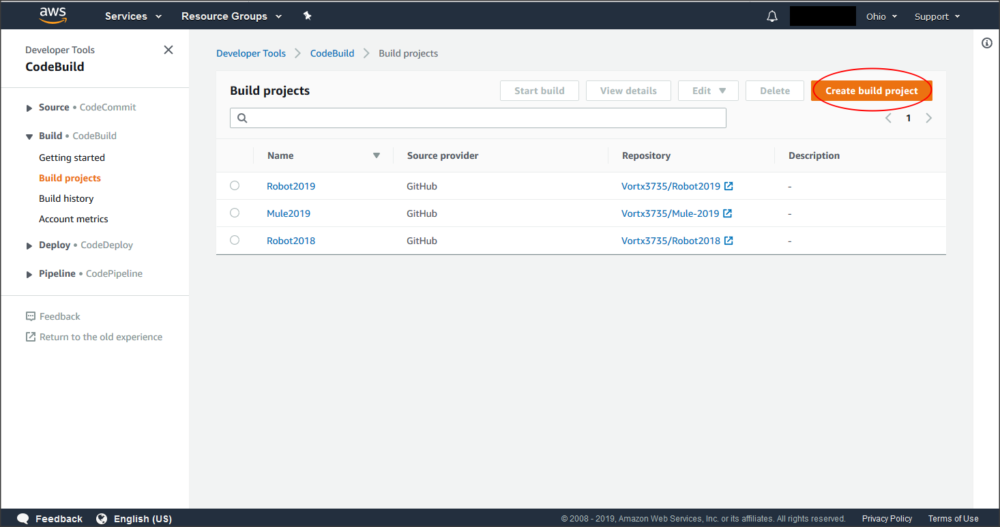
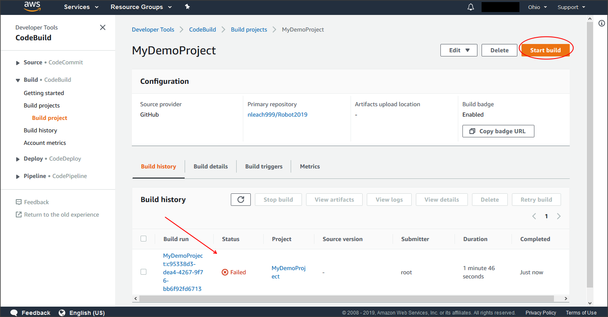

# Continuous Integration (CI) with Docker, AWS CodeBuild, and Slack
Greetings from the [VorTX 3735](http://www.vortx3735.org/ "VorTX 3735") FRC Robotics Team in Houston, TX!

If you have ever experienced members of your team checking in code that will not build on any other team member's box, a [Continuous Integration (CI)](https://en.wikipedia.org/wiki/Continuous_integration) build is for you!

The concept is simple: every time someone checks in a code change, the code is downloaded and a build is performed.  If the build is successful,
no one notices the build occurred.  If there is a failure, a notification with a build log is posted to your team's Slack channel.  The breaking change can
be rolled back or a fix can be checked in for another build attempt.

# How does it work?

If you want to build your code, there must be a computer available that can monitor the source control repository, perform the checkout, and execute the build.  Dedicating a machine for this purpose is not always feasible for a variety of reasons, so this solution uses the [Amazon Web Services (AWS) CodeBuild](https://aws.amazon.com/codebuild/) to allocate resources that perform all the build activities when a change is checked into the source control repository.

This example uses GitHub as the source control repository and AWS CodeBuild as the build infrastructure.  Currently the [public image](https://cloud.docker.com/u/nleach9999/repository/docker/nleach9999/vortx3735 "Docker Hub") in unlikely to work with any cloud provider other than AWS. Other cloud providers have similar capabilities and this image could be modified to be compatible with any cloud provider.  

Build notifications are sent to a team's Slack channel.  If you're not using Slack, this image may be modified to use a notification method other than Slack.

All the cloud services charge for the code build service.  It is relatively inexpensive; AWS, for example, has a free tier that may cover all build activities for some teams.  For the VorTX 3735 team, the first month's bill totaled $0.26 USD to cover builds on two repositories.  As of the writing of this README, our estimated CodeBuild expenses for this month totals $0.06 USD.

# Step-by-Step Instructions

This section will cover step-by-step instructions for configuring the CI build for AWS with GitHub and Slack. 

Prerequisites:

- Administrative access on an AWS account
- Administrative access for a channel on Slack
- A GitHub repository; administrative access may only be required for private repositories

Unless there is a need to change the Docker image, making this work requires only configuration of AWS CodeBuild and Slack.

## Step 1: Configure Slack

Add a Slack channel, in this case I named mine `ci_demo`.


Now select `Administration->Manage Apps` so you can add the notification application to your Slack account.


Search for **Incoming WebHooks** and click on the tile to configure the application.


Click "Add Configuration"


Choose the channel where the notifications will appear.  I selected the `ci_demo` channel I made earlier.


Select `Add Incoming WebHooks Integration`


You can review the integration settings to change the name used by the web hook, the icon displayed next to notifications, etc.  The important part to note is in the **Integration Settings** section.  Scroll down to the **Integration Settings** section and note the `Webhook URL`.  The value of the `Webhook URL` will be used to configure the Docker build image. Click **Save Settings** at the bottom of the configuration page to ensure that the webhook is properly configured.


## Step 2: Configure AWS CodeBuild

Go to the AWS CodeBuild **Build Projects** windows and click the `Create Build Project` button.





Type in the name of your project (*the screen shot shows spaces **but** don't use spaces in the name*), an optional description, and click `Enable Build Badge` if you want to have the badge () displayed in the README markdown file on the repository browser page.


In the **Source** configuration, select the `Source Provider` from the dropdown.  In this case, GitHub is used.

You may select `Public Repository` and enter the `git clone` URL or you may enter your GitHub credentials and select `Repository in my GitHub Account`.  I have repositories in my GitHub account that are private, so I selected `Repository in my GitHub Account` and the dropdown `GitHub Repository` appears with a list of all repositories to which I have access.

*There are some security settings that are needed to enable CodeBuild to ask GitHub for a list of repositories and potentially for instructing GitHub to send notifications to CodeBuild for each repository push.  [This article](https://stackoverflow.com/questions/32397338/aws-codepipeline-not-able-to-access-organizations-repositories "Article about GitHub security settings") may be helpful if you can't see your repositories in the dropdown*


In the **Primary source webhook events** section, select the checkbox `Rebuild every time a code change is pushed to this repository`.


In the **Environment** section: 
* Set the **Environment image** to `Custom Image`
* Set the **Environment type** to **Linux**
* Set the **Image registry** as `Other Registry`
* Set the **External registry URL** to `registry.hub.docker.com/nleach9999/vortx3735:build-2019`. 

*(Please look at [the Docker Hub page](https://cloud.docker.com/u/nleach9999/repository/docker/nleach9999/vortx3735 "Docker Hub") for the Docker image to determine which tag is most suitable for your use.)*


Scroll down in the **Environment** section and expand the **Additional configuration** section.  Some environment variables need to be set to enable the Docker image to send Slack notifications and do timezone conversions for the report.

Add two environment variables:

* SLACK_HOOK_URI *(required)* - Set to the URL that was created when you configured the `Incoming WebHooks Integration` in Slack.
* REPORT_TIMEZONE *(optional)* - If this variable is not provided, all times reported in the Slack notification will be in UTC.  The timezone string must be from the [list of supported time zone strings](https://gist.github.com/heyalexej/8bf688fd67d7199be4a1682b3eec7568 "pytz timezone strings").


Scroll to the bottom of the project configuration and select `Create build project` to complete the setup.


The CI build should now be working.  You can either click the `Start build` button or push a commit to your source code repository to check that the build is complete.  In this example, you can see the build failed.



Upon failure, a message is sent to the `#ci_demo` Slack channel with the build log attached.  Click the `Show more` link to expand the view to see the details of the failure.


# Miscellaneous Notes

## Build Badge


It is very helpful to have the build status badge in the README<span>.</span>md.  In the build project definition screen, there is a button to **Copy badge URL** that will give you a URL that you can paste into README<span>.</span>md like so:

```

```

For the VorTx 3735 robot code, this is the line containing the badge URL for their CodeBuild project.

```

```

# Building the Docker Image

Building the Docker image is not required for enabling your own CI build with AWS and Slack.  If you REALLY are determine to build the Docker image, it may be done with Gradle.  To build the image, build the task `DockerBuild`:

```
gradlew DockerBuild
```

The build may take some time as it downloads the FRC 2019 toolset (1GB+) to build the complete image. You may view the [Dockerfile](Docker/Dockerfile "Dockerfile") to see some ARG variables that may be used to instruct the build to use a local version of the FRC 2019 toolset tarball.


The `ImageTag` task will tag the image as it is in the [Docker Hub public image](https://cloud.docker.com/u/nleach9999/repository/docker/nleach9999/vortx3735 "Docker Hub"):


The `ImagePush` task will attempt to push the image to my Docker hub repository, which should fail for anyone except myself.  You may modify the Gradle script to push your customizations to your own repository.

